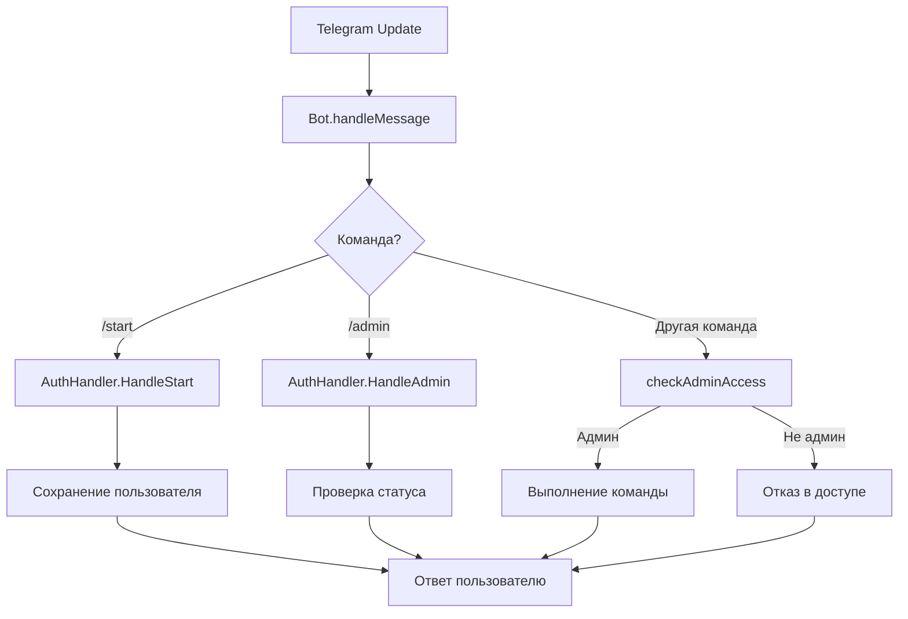

# API Reference

## 📡 Telegram Bot API

Team Bot использует официальную библиотеку [go-telegram-bot-api/v5](https://github.com/go-telegram-bot-api/telegram-bot-api) для взаимодействия с Telegram API.

## 🤖 Bot Commands

### Публичные команды

#### `/start`
Регистрация нового пользователя в системе.

**Доступ:** Все пользователи

**Поведение:**
1. Создает запись пользователя в базе данных
2. Сохраняет Telegram ID, username, chat ID
3. Устанавливает статус администратора в `false`
4. Отправляет приветственное сообщение с inline-клавиатурой

**Пример ответа:**
```
Привет, @username! Я бот для управления командой.
[Кнопка: Say Hello]
```

#### `/admin`
Проверка административного статуса пользователя.

**Доступ:** Зарегистрированные пользователи

**Поведение:**
1. Проверяет статус пользователя в базе данных
2. Возвращает соответствующее сообщение

**Возможные ответы:**
- `✅ Вы являетесь администратором.`
- `❌ Вы не являетесь администратором.`

### Административные команды

Все остальные команды требуют административных прав.

**Контроль доступа:**
- Проверка статуса `is_admin` в базе данных
- При отсутствии прав отправляется сообщение: `❌ Доступ запрещён. Эта команда доступна только администраторам.`

## 🏗️ Внутренний API

### Bot Structure

```go
type Bot struct {
    api         *tgbotapi.BotAPI          // Telegram API клиент
    authRepo    *sqlrepo.AuthRepository   // Репозиторий авторизации  
    authHandler *handler.AuthHandler      // Обработчик авторизации
}
```

### Bot Methods

#### `New(api, authRepo) *Bot`
Создает новый экземпляр бота.

**Параметры:**
- `api *tgbotapi.BotAPI` - клиент Telegram API
- `authRepo *sqlrepo.AuthRepository` - репозиторий для работы с пользователями

**Возвращает:** `*Bot`

#### `Start(ctx context.Context)`
Запускает основной цикл обработки сообщений.

**Параметры:**
- `ctx context.Context` - контекст для graceful shutdown

**Поведение:**
1. Настраивает получение updates от Telegram
2. Запускает бесконечный цикл обработки
3. Корректно завершается при отмене контекста

#### `handleMessage(ctx, update)`
Обрабатывает входящие сообщения.

**Параметры:**
- `ctx context.Context` - контекст выполнения
- `update *tgbotapi.Update` - обновление от Telegram

**Логика обработки:**
1. Проверяет тип сообщения
2. Маршрутизирует команды к соответствующим обработчикам
3. Проверяет права доступа для административных команд

#### `checkAdminAccess(ctx, userID, chatID) bool`
Проверяет административные права пользователя.

**Параметры:**
- `ctx context.Context` - контекст выполнения
- `userID int64` - Telegram ID пользователя
- `chatID int64` - ID чата для отправки ошибки

**Возвращает:** `bool` - true если пользователь администратор

## 🔧 AuthHandler API

### Structure

```go
type AuthHandler struct {
    bot  *tgbotapi.BotAPI
    repo *sqlrepo.AuthRepository
}
```

### Methods

#### `NewAuthHandler(bot, repo) *AuthHandler`
Создает новый обработчик авторизации.

#### `HandleStart(ctx, update) error`
Обрабатывает команду `/start`.

**Поведение:**
1. Извлекает данные пользователя из update
2. Создает модель User
3. Сохраняет в базе данных через репозиторий
4. Отправляет приветственное сообщение

#### `HandleAdmin(ctx, update) error`
Обрабатывает команду `/admin`.

**Поведение:**
1. Проверяет статус пользователя в БД
2. Формирует соответствующий ответ
3. Отправляет сообщение пользователю

#### `CheckAdminAccess(ctx, userID, chatID) (bool, error)`
Проверяет административные права с детальной обработкой ошибок.

## 🗄️ Repository API

### AuthRepository Structure

```go
type AuthRepository struct {
    db *sql.DB
}
```

### CRUD Operations

#### `SaveUser(ctx, user) error`
Сохраняет или обновляет пользователя.

**SQL Query:**
```sql
INSERT INTO users (id, username, chat_id, created_at, is_admin)
VALUES (?, ?, ?, ?, ?)
ON CONFLICT(id) DO UPDATE SET
    username = excluded.username,
    chat_id = excluded.chat_id,
    is_admin = excluded.is_admin
```

#### `GetUserByID(ctx, id) (*User, error)`
Получает пользователя по Telegram ID.

#### `GetUserByChatID(ctx, chatID) (*User, error)`
Получает пользователя по Chat ID.

#### `GetUserByUsername(ctx, username) (*User, error)`
Получает пользователя по username.

#### `IsAdmin(ctx, userID) (bool, error)`
Проверяет административный статус пользователя.

#### `SetAdminStatus(ctx, userID, isAdmin) error`
Устанавливает административный статус пользователя.

## 📊 Data Models

### User Model

```go
type User struct {
    ID          int64     `json:"id"`          // Telegram User ID
    Username    string    `json:"username"`    // Telegram username
    ChatID      int64     `json:"chat_id"`     // Telegram Chat ID
    CreatedTime time.Time `json:"created_time"` // Время регистрации
    IsAdmin     bool      `json:"is_admin"`    // Статус администратора
}
```

### Message Model

```go
type Message struct {
    ID        int64     `json:"id"`        // Уникальный ID сообщения
    ChatID    int64     `json:"chat_id"`   // ID чата
    Text      string    `json:"text"`      // Текст сообщения
    UserID    int64     `json:"user_id"`   // ID отправителя
    Username  string    `json:"username"`  // Username отправителя
    Timestamp time.Time `json:"timestamp"` // Время отправки
    Type      string    `json:"type"`      // Тип сообщения
}
```

## 🔄 Update Processing Flow



## 🎯 Response Types

### Success Response
```go
// Успешный ответ пользователю
msg := tgbotapi.NewMessage(chatID, "Успешное сообщение")
bot.Send(msg)
```

### Error Response
```go
// Ошибка доступа
msg := tgbotapi.NewMessage(chatID, "❌ Доступ запрещён...")
bot.Send(msg)
```

### Interactive Response
```go
// Ответ с клавиатурой
keyboard := tgbotapi.NewInlineKeyboardMarkup(
    tgbotapi.NewInlineKeyboardRow(
        tgbotapi.NewInlineKeyboardButtonData("Кнопка", "callback_data"),
    ),
)
msg := tgbotapi.NewMessage(chatID, "Сообщение с кнопками")
msg.ReplyMarkup = keyboard
bot.Send(msg)
```

## 🔍 Error Handling

### Repository Errors
```go
// sql.ErrNoRows - пользователь не найден
if err == sql.ErrNoRows {
    return nil, nil  // Возвращаем nil без ошибки
}

// Другие ошибки БД
if err != nil {
    return nil, fmt.Errorf("database error: %v", err)
}
```

### Handler Errors
```go
// Логирование и возврат ошибки
if err := handler.HandleStart(ctx, update); err != nil {
    log.Printf("Error handling /start: %v", err)
    // Опционально отправить сообщение об ошибке пользователю
}
```

### Bot Errors
```go
// Ошибки отправки сообщений
if _, err := bot.Send(msg); err != nil {
    log.Printf("Error sending message: %v", err)
    // Не прерываем выполнение, только логируем
}
```

## 🔧 Configuration API

### Config Structure
```go
type Config struct {
    Bot struct {
        Token string `yaml:"token"`
        Debug bool   `yaml:"debug"`
    } `yaml:"bot"`
    
    Database struct {
        Type string `yaml:"type"`
        Path string `yaml:"path"`
    } `yaml:"database"`
    
    TelegramAdmins struct {
        Usernames []string `yaml:"username"`
    } `yaml:"admins"`
}
```

### Loading Configuration
```go
func LoadConfig(path string) (*Config, error)
```

## 📝 Usage Examples

### Создание и запуск бота
```go
func main() {
    // Загрузка конфигурации
    cfg, err := config.LoadConfig("config/config.yaml")
    if err != nil {
        log.Fatal(err)
    }
    
    // Инициализация компонентов
    db, _ := sql.Open("sqlite3", cfg.Database.Path)
    authRepo := sqlrepo.NewAuthRepository(db)
    botAPI, _ := tgbotapi.NewBotAPI(cfg.Bot.Token)
    
    // Создание и запуск бота
    bot := bot.New(botAPI, authRepo)
    ctx := context.Background()
    bot.Start(ctx)
}
```

### Проверка административных прав
```go
func checkAdminAccess(ctx context.Context, userID int64) bool {
    isAdmin, err := authRepo.IsAdmin(ctx, userID)
    if err != nil {
        log.Printf("Error checking admin: %v", err)
        return false
    }
    return isAdmin
}
```

### Добавление нового обработчика команд
```go
func (b *Bot) handleMessage(ctx context.Context, update *tgbotapi.Update) {
    message := update.Message
    
    // Добавить новую команду
    if message.IsCommand() && message.Command() == "newcommand" {
        if !b.checkAdminAccess(ctx, message.From.ID, message.Chat.ID) {
            return
        }
        
        // Логика новой команды
        msg := tgbotapi.NewMessage(message.Chat.ID, "Новая команда выполнена")
        b.api.Send(msg)
        return
    }
    
    // Существующая логика...
}
```
